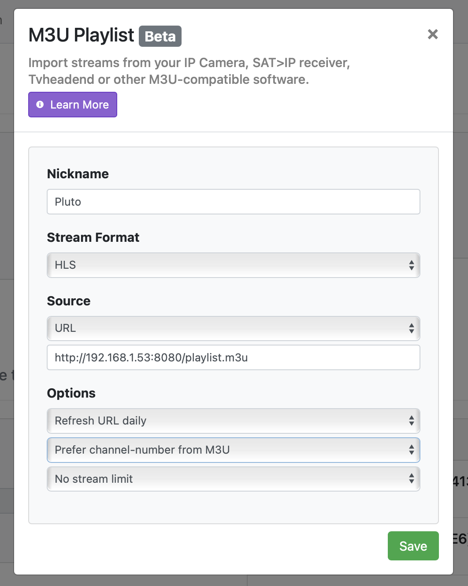
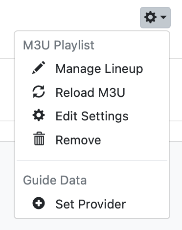
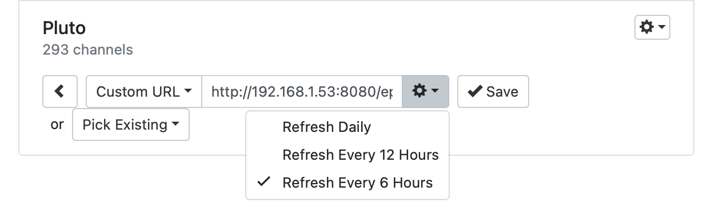

# Pluto for Channels

This simple Docker image will generate an M3U playlist and EPG optimized for use in [Channels](https://getchannels.com) and expose them over HTTP.

[Channels](https://getchannels.com) supports [custom channels](https://getchannels.com/docs/channels-dvr-server/how-to/custom-channels/) by utilizing streaming sources via M3U playlists.

[Channels](https://getchannels.com) allows for [additional extended metadata tags](https://getchannels.com/docs/channels-dvr-server/how-to/custom-channels/#channels-extensions) in M3U playlists that allow you to give it extra information and art to make the experience better. This project adds those extra tags to make things look great in Channels.

## Set Up

Running the container is easy. Fire up the container as usual. You can set which port it runs on.

    docker run -d --restart unless-stopped --name pluto-for-channels -p 8080:80 jonmaddox/pluto-for-channels

You can retrieve the playlist and EPG via the status page.

    http://127.0.0.1:8080

### Optionally have multiple feeds generated

By using the `VERSIONS` env var when starting the docker container, you can tell it to create multiple feeds that can be used elsewhere.

Simply provide a comma separated list of words without spaces with the `VERSIONS` env var.

    docker run -d --restart unless-stopped --name pluto-for-channels -p 8080:80 -e VERSIONS=Dad,Bob,Joe jonmaddox/pluto-for-channels

### Optionally provide a starting channel number

By using the `START` env var when starting the docker container, you can tell it to start channel numbers with this value. Original Pluto channel numbers will be added to this, keeping all of the channels in the same order they are on Pluto.

You should use a starting number greater than 10000, so that the channel numbers will be preserved but not conflict with any other channels you may have.

For example, channel 345 will be 10345. Channel 2102 will be 12102.

Simpley provide a starting number with the `START` env var.

    docker run -d --restart unless-stopped --name pluto-for-channels -p 8080:80 -e START=80000 jonmaddox/pluto-for-channels

## Add Source to Channels

Once you have your Pluto M3U and EPG XML available, you can use it to [custom channels](https://getchannels.com/docs/channels-dvr-server/how-to/custom-channels/) channels in the [Channels](https://getchannels.com) app.

Add a new source in Channels DVR Server and choose `M3U Playlist`. Fill out the form using your new playlist URL.



Next, set the provider for your new source and choose custom URL.



Finally, enter your EPG xml url and set it to refresh every 6 hours.



## Alpine Linux Package

For those of you who use LXC Containers without Docker, there also is an option to generate an untrusted APK file for install to as many containers as needed.  Here are the steps:

1. Clone the git repo locally
2. cd [root of the git repo]
3. Run build script (this will run Docker to generate the APK)
```
apk/build
```
4. copy the 2 APKs from apk/outputs to your LXC container
```
# ls -la apk/outputs/src/aarch64/*.apk
apk/outputs//src/aarch64/pluto-for-channels-1.2.15-r0.apk		apk/outputs//src/aarch64/pluto-for-channels-openrc-1.2.15-r0.apk
# scp apk/outputs/src/aarch64/*.apk user@lxc-container:
```
5. Login to the LXC Container
6. Install the APKs
```
# apk add --allow-untrusted ./pluto-for-channels-1.2.15-r0.apk ./pluto-for-channels-openrc-1.2.15-r0.apk
```
7. Customize as you see fit, Environment variables for the daemon are in /etc/conf.d/pluto-for-channels
8. Enable the service
```
/usr/src/app/enable
```

### If you want to uninstall, do the following:

1. Disable the service
```
/usr/src/app/disable
```
2. Uninstall the packges:
```
# apk del pluto-for-channels pluto-for-channels-openrc
```